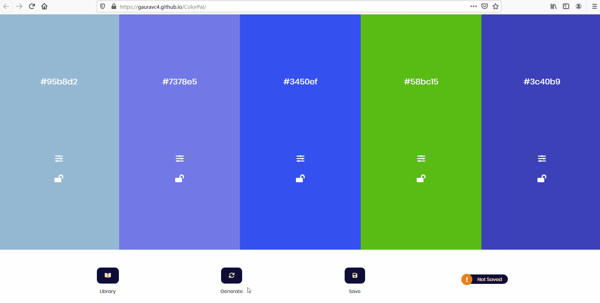

# ***Color Pal***
If only we could remember that amazing coloring scheme we came across the other day.

But thats easier said than done. ***Color Pal*** to the rescue!
> pun intended.

You can use Color Pal to save your custom color palettes required for web dev.

https://gauravc4.github.io/ColorPal/

## Installation
For local install, just clone the repo and run `index.html`

## Demo

##  Usage
- [X] Choose the right color that suits your palette by adjusting th [HSL](https://en.wikipedia.org/wiki/HSL_and_HSV) (Hue Saturation Level) settings.

- [X] Lock it in so you don't lose it.
-  [X] Copy the HEX value to clipboard with just one click.
- [X] Save your palette by giving it an appropriate name.
- [X] Notice the save status at bottom right corner being changed. :sparkles:
- [X] Select your saved palette from library to work with. 
- [X] Gasp in awe as you realize your most recently used items are always at the top of library, so you don't have to scroll for your favourite palette. :scream:
- [X] Then read about [LRU](https://en.wikipedia.org/wiki/Cache_replacement_policies#Least_recently_used_(LRU)) (Least Recently Used) Cache, which bubbles most frequently used items to top and deletes least recently used items once cache is full. :flushed: 
- [X] Realize it wasn't such a big deal after all. :sleepy:

## Technology used
It is based on HTML, CSS and Vanilla JavaScript. I have tried to implement [javascript module pattern](https://www.oreilly.com/library/view/learning-javascript-design/9781449334840/ch09s02.html).

Used [chorma.js](https://gka.github.io/chroma.js/), a great coloring library for color conversions and scales.

How can I forget [Font Awesome](https://fontawesome.com/) and [Flaticon](https://www.flaticon.com/authors/freepik) for their amazing icons.

## Credits
I have made this project as a part of Creative JavaScript course by [Dev Ed](https://www.youtube.com/channel/UClb90NQQcskPUGDIXsQEz5Q).

If you like this, I am sure you will love his course as well. Check it out here https://developedbyed.com/
